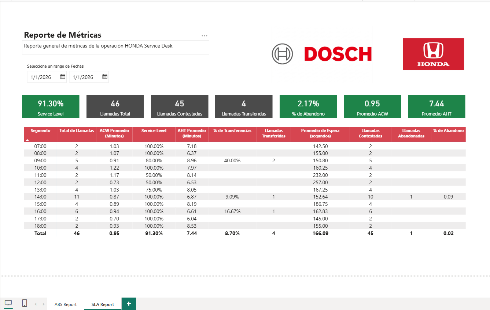
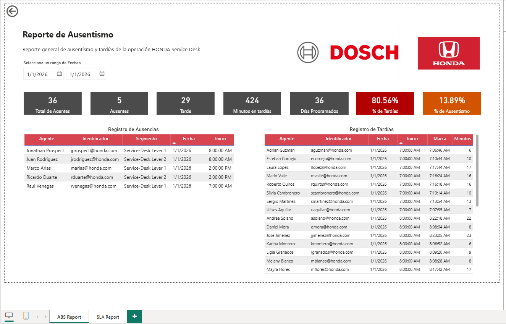
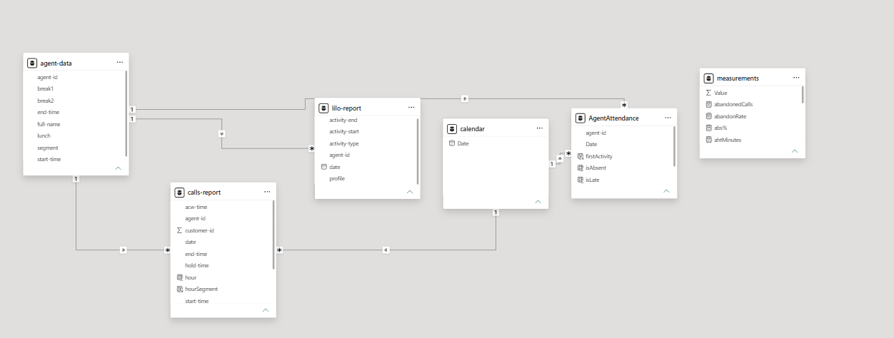

# 📊 WFM Dashboard — Honda Service Desk

> Workforce Management KPI Dashboard built in Power BI, simulating a real outsourcing operation for statistical analysis and data-driven decision making.


---

## 📋 Project Overview

This project simulates a **Workforce Management (WFM)** environment for a fictional outsourcing company (**Dosch**) providing technical phone support to Honda mechanics in the US on behalf of **Honda Motors USA**.

The goal was to design a complete WFM reporting infrastructure — from data generation to interactive Power BI dashboards — capable of tracking operational KPIs in a formal, client-ready format.

The project was developed as part of the **Probability and Statistics I (FCP0)** course at **Universidad Cenfotec**, and demonstrates how statistical analysis and data visualization tools can be applied to real-world call center environments.


## 📸 Screenshots

### SLA Metrics Report


### Absenteeism Report


## Model 


---

## 🎯 Operational KPI Targets

The following KPIs were defined by the client (Honda Motors USA) as minimum compliance thresholds:

| KPI | Target | Description |
|---|---|---|
| **Service Level** | > 90% | % of calls answered within the defined time window |
| **Schedule Adherence** | > 95% | % of agents following their assigned schedule |
| **ACW (After Call Work)** | < 3 min | Avg time spent on post-call administrative tasks |
| **Transfer Rate** | < 25% | % of calls escalated to another agent or supervisor |
| **AHT (Avg Handle Time)** | < 10 min | Total avg call duration including hold and ACW |
| **Abandonment Rate** | < 15% | % of callers who hung up before being answered |
| **Absenteeism** | < 7% | % of agents absent from their scheduled shift |

---

## 🏗️ Architecture

The solution connects three components:

```
WFM Generator App (Web)
        │
        ▼
  Google OAuth ──► Google Drive API ──► Google Sheets (3 datasets)
                                               │
                                               ▼ (Public CSV URL)
                                          Power BI Desktop
                                               │
                                               ▼
                                     Interactive Dashboards
```

### Data Sources (Google Sheets)

| Dataset | Description |
|---|---|
| `login_logout_report` | Agent session logs — used for adherence & absenteeism tracking |
| `calls_report` | Inbound/outbound call history — used for SLA, AHT, ACW, transfer metrics |
| `agent_data` | Agent schedules — shift start/end times, breaks, and lunch windows |

Power BI connects to all three sheets via **public CSV URLs**, requiring no authentication.

---

## 📊 Dashboard Pages

### Page 1 — Absenteeism Report (`ABS Report`)

Tracks daily agent attendance and tardiness. Key cards and tables include:

- **Total Agents** scheduled for the selected date
- **Total Absent** — agents who did not log in
- **Total Late** — agents who clocked in after their scheduled start
- **Total Minutes Late** — aggregate tardiness across the team
- **Absenteeism %** — daily absence rate
- **Tardiness %** — daily late arrival rate
- **Scheduled Days** — total planned agent-days
- Drill-down tables for individual **absence** and **tardiness** records with agent ID, segment, date, and time details

### Page 2 — Operational Metrics Report (`SLA Report`)

Tracks call center performance across all major SLA KPIs. Key cards and visuals include:

- **Service Level** — % of calls answered within the SLA window
- **Total Calls** received
- **Answered Calls**
- **Transferred Calls**
- **Abandonment Rate**
- **Avg ACW (After Call Work)** in minutes
- **Avg AHT (Handle Time)** in minutes
- **Pivot table by hour segment** — breaks down all metrics by time of day for intraday analysis

---

## 📂 Dataset Schemas

### `login_logout_report`

```
agent-id | date | activity-type | activity-start | activity-end | profile
```

### `calls_report`

```
customer-id | agent-id | start-time | end-time | date | wait-time | acw-time | talk-time | hold-time | transferred
```

### `agent_data`

```
agent-id | start-time | end-time | full-name | break-1 | break-2 | lunch
```

---

## 📐 DAX Measures

All DAX measures are documented in [`DAX_Measures.md`](DAX_Measures.md).

The `measurements` table contains the following calculated measures:

| Measure | Category |
|---|---|
| `totalCalls`, `answeredCalls`, `abandonedCalls`, `transferedCalls` | Volume |
| `serviceLevel`, `Service Level (<3min)`, `abandonRate`, `transferRate` | SLA & Quality |
| `avgAfterCallWork`, `ahtMinutes` | Handle Time |
| `totalAgents`, `totalAbsent`, `totalLate`, `totalMinutesLate` | Attendance |
| `abs%`, `late%`, `totalScheduledDays` | Absenteeism |

### Data Model Relationships

```
agent-data[agent-id]  ──(1:M)──  AgentAttendance[agent-id]
agent-data[agent-id]  ──(1:M)──  calls-report[agent-id]
calendar[Date]        ──(1:M)──  calls-report[date]
calendar[Date]        ──(1:M)──  AgentAttendance[Date]
```

---

## 📈 Statistical Analysis Summary

The following analyses were conducted using simulated data from the week of **January 12–16, 2026**:

### ACW (After Call Work)
- **Mean:** 3.85 min | **Median:** 3.86 min
- 90% of agents maintained ACW below **3.985 min**
- ACW peaked in the **07:00–09:00** and **18:00–24:00** windows

### Transfer Rate
- **Overall transfer rate:** 16.2% (within the <25% target)
- Peak transfers occurred between **15:00–18:00** (30 of 84 total transfers)
- 80% of hourly periods stayed below 22 transfers (Decile 8)

### Research Findings
1. **ACW vs. Transfer Rate:** Positive correlation observed — agents with higher ACW tend to transfer fewer calls, suggesting more thorough first-contact resolution
2. **Call Volume by Hour:** Peak activity between 15:00–18:00; lowest volume in early morning and late night
3. **Adherence vs. AHT:** Agents with lower adherence showed higher AHT, suggesting schedule deviations reduce call-handling efficiency

---

## 🛠️ Tech Stack

| Tool | Purpose |
|---|---|
| **Power BI Desktop** | Dashboard creation and data modeling |
| **Google Sheets** | Cloud-based dataset storage |
| **Google Drive API** | File creation and management |
| **Google Sheets API** | Read/write operations on datasets |
| **Google OAuth 2.0** | Secure authentication for the data generator |
| **WFM Generator Web App** | Custom web app for simulated data generation |

---

## 🚀 Getting Started

### Prerequisites
- Power BI Desktop installed
- A Google account (for the data generator)

### Connect Power BI to the Data Sources

1. Open the `.pbix` file in Power BI Desktop
2. Go to **Home → Transform Data → Data Source Settings**
3. Update the Google Sheets URLs if needed
4. Refresh the dataset

### Using the WFM Data Generator

1. Open the WFM Generator app
2. Sign in with your Google account (OAuth)
3. The app will locate or create the required Sheets in your Drive
4. Select the date range and generate data
5. Refresh Power BI to load the new records

> ⚠️ Data generated is fictional and intended for demonstration and statistical analysis purposes only.

---

## 📁 Project Structure

```
📦 wfm-dashboard-honda
 ┣ 📊 WFM_Honda_ServiceDesk.pbix     # Power BI report file
 ┣ 📄 DAX_Measures.md                # All DAX measures documented
 ┣ 📁 images/
 ┃ ┣ 🖼️ sla-report.png               # SLA metrics dashboard
 ┃ ┗ 🖼️ abs-report.png               # Absenteeism dashboard
 ┗ 📄 README.md
```

---

## 👤 Authors

**Sebastián Ortiz Vargas** — [LinkedIn](https://linkedin.com/in/sortizvargas0302)

**Julio Alberto Salvador Quirós** - [LinkedIn](https://www.linkedin.com/in/juliosalvador2302/)

Universidad Cenfotec — Probability and Statistics I (FCP0) · C1-2025

---

## 📄 License

This project was developed for academic purposes. Data is entirely simulated and does not represent any real company or operation.
